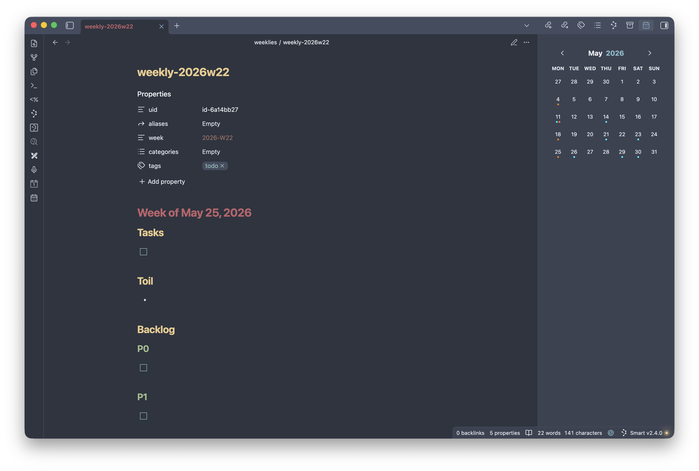

# Obsidian FlexiCal

FlexiCal is a flexible calendar plugin for Obsidian that surfaces the notes you
care about in a calendar view. You define one or more calendars, each with its
own filter and color, and FlexiCal marks the days that have matching notes.

## What it does

- Adds a calendar to the right sidebar (open it with the **Show calendar**
  ribbon icon).
- For every calendar you configure, FlexiCal scans your vault for notes whose
  frontmatter date falls in the month being viewed and that match the
  calendar's filter.
- Matching notes are shown as small colored dots on their day, using each
  calendar's color. Days with matches from multiple calendars show a dot per
  calendar, up to six dots per day.
- A note belongs to only one calendar: the first calendar (in the order listed
  in settings) whose filter and date field it matches. Reorder calendars to
  change which one claims a shared note.
- Click a day to open its notes. If a single note matches, it opens directly;
  if several match, a picker lets you choose.
- The view updates automatically as notes are created, modified, or deleted.

## Configuration

Open **Settings → FlexiCal** to configure the plugin.

### Calendars

This is the heart of FlexiCal. Use the **+** button next to the Calendars
heading to add a calendar, and the trash icon on a calendar to remove it. The
order calendars appear in matters: a note is claimed by the first calendar it
matches, so list more specific calendars above more general ones. Each calendar
has the following settings:

- **Name** — A label for the calendar. Used only to identify it in settings.
- **Color** — The color of the dots drawn for this calendar's matching notes.
- **Date field** — The frontmatter property that holds a note's date (for
  example, `date`). A note is placed on the day given by this field. Values may
  be a plain date (`2026-06-14`) or a full timestamp; dates are interpreted in
  UTC.
- **Week field** — Optional. The frontmatter property that holds a note's ISO
  week (for example, `2026-W33`), for weekly notes. When a note has no value
  for the date field, FlexiCal falls back to this field and places the note on
  the Monday of that week.
- **Filter** — Optional. Restricts which notes this calendar includes. Click
  **Edit filter** to open the filter builder. Filters can be combined and
  nested:
  - **All of the following…** — matches a note only if every child filter
    matches (AND).
  - **Any of the following…** — matches if at least one child filter matches
    (OR).
  - **None of the following…** — matches only if no child filter matches (NOT).
  - **Frontmatter property…** — matches on a frontmatter property by type
    (text, number, date, checkbox, list, or tag), each with type-appropriate
    operators (such as contains, equals, greater/less than, or regex).
  - **File path…** — matches notes whose path fits a glob pattern (for example,
    `journal/*.md`).

  With no filter, a calendar includes every note that has a value for its date
  (or week) field and hasn't already been claimed by an earlier calendar.

### Debug mode

Enables verbose logging to the developer console. Leave this off for normal
use; turn it on only when troubleshooting.
